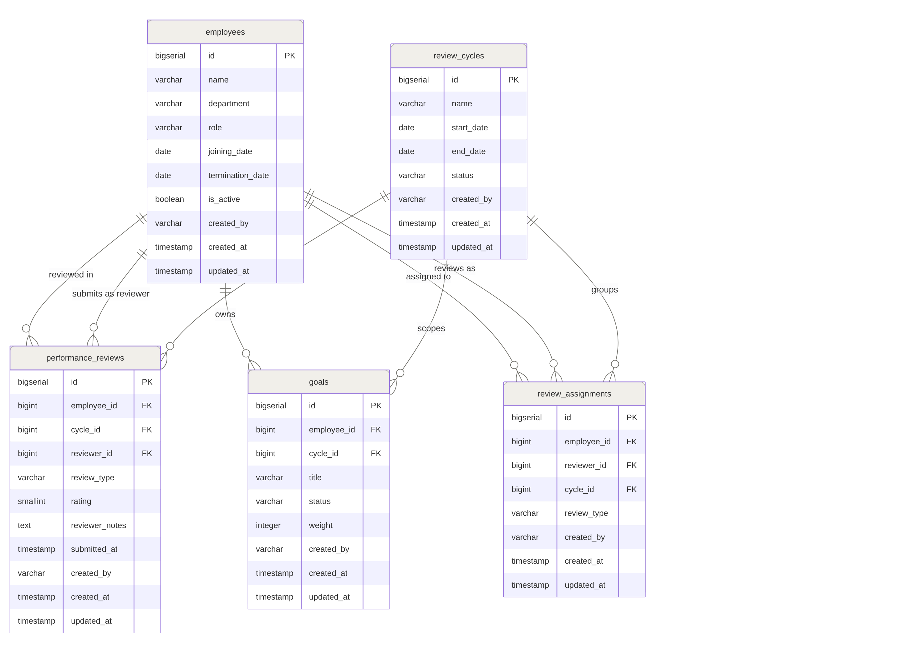

# HR Performance Tool

A Spring Boot backend for tracking and reviewing employee performance. Built for internal HR use - allows managers to create review cycles, submit performance reviews, track goals, and generate cycle summaries.

---

## Tech Stack

| Layer | Technology |
|---|---|
| Language | Java 21 |
| Framework | Spring Boot 3.2 |
| Persistence | JPA / Hibernate |
| Database | PostgreSQL (production), H2 (development) |
| Migrations | Flyway |
| Build | Maven |
| Boilerplate | Lombok |

---

## Running Locally (H2 - No Docker Required)

### 1. Set/Verify application-dev.properties

```properties
spring.datasource.url=jdbc:h2:file:./data/hrdb;MODE=PostgreSQL;AUTO_SERVER=TRUE
spring.datasource.driver-class-name=org.h2.Driver
spring.datasource.username=sa
spring.datasource.password=

spring.jpa.hibernate.ddl-auto=update
spring.jpa.show-sql=true
spring.jpa.properties.hibernate.dialect=org.hibernate.dialect.H2Dialect

spring.flyway.enabled=false
spring.h2.console.enabled=true

server.port=8080
```

### 2. Run in IntelliJ

Open `PerformanceApplication.java` and click the green ▶ button next to `main`.


### 3. H2 Console (browser)

```
URL:      http://localhost:8080/h2-console
JDBC URL: jdbc:h2:file:./data/hrdb
Username: sa
Password: (blank)
```

---

## Running with PostgreSQL (Docker)

```bash
docker run -d \
  -e POSTGRES_DB=hr_performance \
  -e POSTGRES_PASSWORD=password \
  -p 5432:5432 postgres:16

./mvnw spring-boot:run
```

Update `application-dev.properties`:

```properties
spring.datasource.url=jdbc:postgresql://localhost:5432/hr_performance
spring.datasource.username=postgres
spring.datasource.password=password
spring.jpa.hibernate.ddl-auto=validate
spring.flyway.enabled=true
```
## Diagrams
### System Architecture


### Entity Relations

---
## API Reference

### Cycles

| Method | Endpoint | Description |
|---|---|---|
| `POST` | `/cycles` | Create a review cycle |
| `GET` | `/cycles/{id}/summary` | Average rating (manager-only), top performer, goal counts |
| `POST` | `/cycles/{id}/close` | Close a cycle (validates goal weights first) |

### Employees

| Method | Endpoint | Description |
|---|---|---|
| `POST` | `/employees` | Create an employee |
| `GET` | `/employees` | Filter active employees by department and/or minimum rating |
| `GET` | `/employees/{id}/reviews` | All reviews for an employee with cycle and reviewer details |
| `PATCH` | `/employees/{id}/terminate` | Terminate an employee |

### Reviews

| Method | Endpoint | Description |
|---|---|---|
| `POST` | `/reviews` | Submit a performance review |

### Goals

| Method | Endpoint | Description |
|---|---|---|
| `POST` | `/goals` | Create a goal with a weight for an employee in a cycle |

---

## Sample Request Bodies

### POST /cycles
```json
{
  "name": "Q1 2025",
  "startDate": "2025-01-01",
  "endDate": "2025-03-31"
}
```

### POST /employees
```json
{
  "name": "Alice Kumar",
  "department": "Engineering",
  "role": "Senior SWE",
  "joiningDate": "2021-06-01"
}
```

### POST /reviews
```json
{
  "employeeId": 1,
  "cycleId": 1,
  "reviewerId": 4,
  "reviewType": "manager",
  "rating": 5,
  "reviewerNotes": "Exceptional delivery this quarter."
}
```

### POST /goals
```json
{
  "employeeId": 1,
  "cycleId": 1,
  "title": "Ship auth module",
  "weight": 50
}
```

### PATCH /employees/5/terminate
```json
{
  "terminationDate": "2025-04-01"
}
```

### GET /employees?department=Engineering&minRating=3
```
No body required.
```

---

## Error Responses

All errors follow a consistent structure:

```json
{
  "timestamp": "2025-05-28T10:30:00",
  "status": 404,
  "error": "Not Found",
  "message": "Employee not found: 99"
}
```

| HTTP Status | When |
|---|---|
| `400 Bad Request` | Validation failure, invalid input, business rule violation |
| `404 Not Found` | Employee, cycle, or resource doesn't exist |
| `409 Conflict` | Duplicate unique value (e.g. cycle name already exists) |
| `422 Unprocessable Entity` | Cycle close fails due to goal weight violations |
| `500 Internal Server Error` | Unexpected server error |

---

## Assumptions

The following decisions go beyond the original specification and were made to handle real-world edge cases.

### Reviews

*Multiple reviews per employee per cycle are allowed.*

*Average rating is calculated using manager reviews only.*

*`reviewer_id` is nullable.*

*Reviews cannot be submitted to a closed cycle.*
Once a cycle is closed, `POST /reviews` returns `400 Bad Request`. 
This prevents retroactive data entry after a cycle is locked.

### Employees

*Terminated employees are excluded from forward-looking endpoints.*

*Terminated employees are included in historical cycle summaries if their review predates termination.*

*Termination date must be after joining date.*

*Re-terminating an already terminated employee is rejected.*

### Goals

*Goal weights must sum to exactly 100% per employee per cycle before the cycle can be closed.*

*Adding a goal that would push total weight above 100% is rejected immediately.*

*Goals cannot be added to a closed cycle.*

### Cycle Lifecycle

*Cycles have a status of `open` or `closed`.*
Closed cycles reject new reviews and goals.

*Cycle names must be unique.*

### 360° Reviews

*A `review_type` column distinguishes manager, peer, and self reviews.*

*A `review_assignments` table tracks peer nominations separately from submitted reviews.*

---

## System Design

### Scaling to 500 Concurrent Managers

The app is stateless - no server-side session - so horizontal scaling is straightforward. Deploy multiple instances behind a load balancer (AWS ALB or nginx). The database becomes the bottleneck before the app tier does.

For the DB, use a read replica for all `GET` traffic (reports, summaries, filters) and route writes to the primary. Connection pooling via PgBouncer or HikariCP keeps idle connections from overwhelming PostgreSQL. If report load is bursty (everyone runs summaries at 9 AM on review day), an async queue (SQS + a worker pool) can absorb spikes and return results via polling or websocket.

### Slow `GET /cycles/{id}/summary` at 100k+ Reviews

The summary query does three things: aggregate ratings, find the top performer, and count goals by status. Each is already a single aggregated query with no N+1, but at scale:

1. Add a composite index on `performance_reviews(cycle_id, rating)` so the DB satisfies the aggregation from the index alone (index-only scan).
2. Materialise the summary. A scheduled job or DB trigger on review insert can write a pre-computed `cycle_summaries` table. The API reads that instead of re-aggregating on every request.
3. Partition `performance_reviews` by `cycle_id` if data grows to millions of rows. Each cycle's data lands in its own partition, reducing scan size drastically.

### Caching Strategy

| What | Where | TTL                                      |
|---|---|------------------------------------------|
| `GET /cycles/{id}/summary` | Redis (read-through) | 10 min, invalidated on new review submit |
| `GET /employees/{id}/reviews` | Redis | 2 hours                                  |
| `GET /employees?department&minRating` | Redis keyed on query params | 10 min                                   |

Cache invalidation: `POST /reviews` evicts the affected employee's review cache and the cycle summary cache. Use Spring Cache with a Redis backend (`@Cacheable`, `@CacheEvict`). Avoid caching write paths - only GETs.
